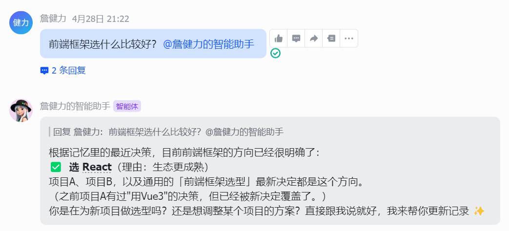
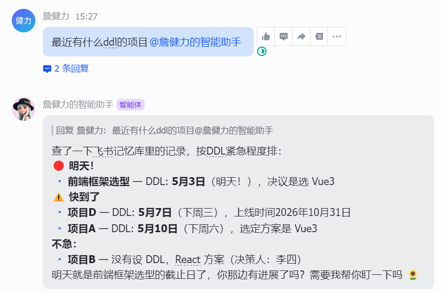
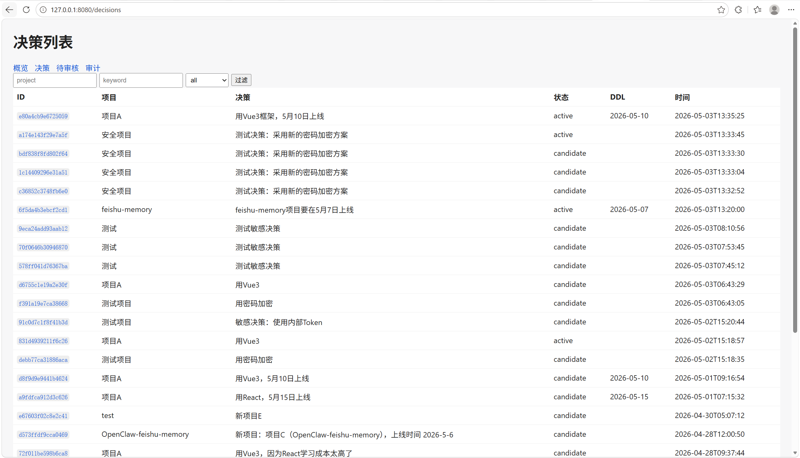

# 🧠 feishu-memory — 飞书项目决策长期记忆引擎

> **让群聊中的每一个决策都被记录、被检索、被推送、被审计。**

<div align="center">


**OpenClaw Skill** · **飞书 AI Challenge Ready** · **Production Grade**

[🎬 演示](#-功能演示) · [✨ 特性](#-核心特性) · [🚀 快速开始](#-快速开始) · [🏗️ 技术架构](#️-系统架构) · [📊 Benchmark](#-benchmark)

</div>

---

## 🎯 一句话介绍

`feishu-memory` 是面向飞书群聊的 **AI 决策长期记忆引擎**。它监听群聊中的项目讨论，自动提取决策、DDL 和关键节点，构建可检索、可审计、可推送的智能记忆体系 —— 让项目决策不再沉没在聊天记录中。

---

## 🎬 功能演示

### Demo 1: 群聊自动记录 + 交互式审核

<table>
<tr>
<td width="50%">

**📹 GIF 演示占位**


> 💡 群聊中出现"决定/上线/截止/DDL"等关键词，系统自动记录为 candidate，并推送交互卡片到群聊供人工确认。

</td>
<td width="50%">

**📸 截图占位**


.png)


**审核结果：**
- 🟡 `candidate` — 新记忆自动进入待审核状态
- ✅ 点击「确认入库」→ `active`
- ❌ 点击「驳回」→ `rejected`
- 📋 审计日志自动记录每一步操作

</td>
</tr>
</table>

---

### Demo 2: L0→L3 分层语义检索

<table>
<tr>
<td width="50%">

**📹 GIF 演示占位**


> 💡 查询"前端框架选什么好"，系统从热缓存→精确匹配→向量语义→LLM深度推理，逐级检索最相关决策。

</td>
<td width="50%">

**📸 截图占位**



**检索层级：**
| 层级 | 范围 | 延迟 |
|------|------|------|
| L0 热缓存 | 最近24h高频访问 | < 1ms |
| L1 精确匹配 | SQLite LIKE | < 10ms |
| L2 向量语义 | Chroma 相似度 | < 50ms |
| L3 深度推理 | LLM 综合归纳 | < 2s |

</td>
</tr>
</table>

---

### Demo 3: DDL 心跳主动推送

<table>
<tr>
<td width="50%">

**📹 GIF 演示占位**


> 💡 DDL 前7天开始，每3天自动推送 urgency 卡片到群聊，🔴紧急 / 🟠预警 / 🟡提醒。

</td>
<td width="50%">

**📸 截图占位**



**推送时间线：**
| 距离DDL | 频率 |  urgency |
|---------|------|---------|
| 7 天 | 第1次 | 🟡 提醒 |
| 4 天 | 第2次 | 🟠 预警 |
| 1 天 | 第3次 | 🔴 紧急 |

</td>
</tr>
</table>

---

### Demo 4: Dashboard 管理后台

<table>
<tr>
<td width="50%">

**📹 GIF 演示占位**


> 💡 本地启动 Web 后台，概览决策数量、审核队列、审计日志、知识图谱关系。

</td>
<td width="50%">

**📸 截图占位**



**后台功能：**
- 📊 概览面板：总决策 / active / candidate 比例
- 📋 决策列表：按 project/status/keyword 过滤
- 🔍 决策详情：审计历史 + 证据链 + 关系图谱
- ✅ 审核队列：一键确认/驳回 candidate

</td>
</tr>
</table>

---

## ✨ 核心特性

### 🏛️ Governance Layer — 决策治理层

```
store_decision() → 默认 status='candidate'
        │
        ▼
   review_policy() ──→ 低风险/无冲突 ──→ status='active'（自动确认）
        │
        └──→ 高冲突 / 敏感词 / 低置信度 ──→ status='candidate'（需人工审核）
                        │
                        ▼
              交互式卡片推送 ──→ 用户点击「确认/驳回」
                        │
                        ▼
              confirm_candidate() ──→ status='active' + audit_log
```

- **Candidate/Active 状态机**：新记忆自动审查，高风险进入人工审核队列
- **审查策略**：confidence<0.5 / 敏感词 / 冲突检测 → candidate
- **审计日志**：`audit_log` 表记录每次 create/confirm/reject/update 操作
- **证据链**：`evidence` 字段追溯原始聊天记录
- **交互式卡片**：飞书群聊内一键确认/驳回，无需命令行

### 🔍 L0→L3 分层检索引擎

| 层级 | 名称 | 技术 | 延迟 | 触发条件 |
|------|------|------|------|----------|
| L0 | 热缓存 | Python dict + access_log 统计 | < 1ms | 每次 query 必先查 |
| L1 | 精确匹配 | SQLite LIKE + BM25 简化 | < 10ms | L0 未命中 |
| L2 | 向量语义 | Chroma + qwen text-embedding-v3 | < 50ms | L1 未命中 |
| L3 | 深度推理 | LLM 综合归纳（qwen-turbo） | < 2s | 结果不足或需总结 |

### 🧬 知识图谱（Knowledge Graph）

```
[Decision: "采用 APISIX"] ──BELONGS_TO──→ [Project: "API网关选型"]
        │
        ├── DECIDED_BY ──→ [Person: "张三"]
        ├── USES ──→ [Technology: "APISIX"]
        ├── USES ──→ [Technology: "etcd"]
        ├── HAS_DEADLINE ──→ [Deadline: "2026-05-10"]
        └── SUPERSEDES ──→ [Decision: "旧决策"]
```

- 自动抽取 Project / Decision / Person / Technology / Deadline 实体
- 支持自然语言查询：`"项目A用了哪些技术"`、`"项目A的决策人是谁"`

### ⏰ DDL 心跳推送（Heartbeat）

- **定时扫描**：每12小时检查 `decisions.deadline`
- **推送规则**：DDL 前7天开始，每3天推送一次
- **去重机制**：`push_log` 表记录已推送节点，避免骚扰
- **urgency 分级**：🔴 <3天 / 🟠 <7天 / 🟡 提醒

### 📊 Benchmark 质量评估框架

| 维度 | 指标 | 权重 |
|------|------|------|
| 准确性 | candidate 比例 / active 被覆盖率 | 35% |
| 完整性 | deadline 提取率 | 25% |
| 时效性 | 遗忘率 | 25% |
| 覆盖率 | 项目覆盖率 | 15% |

- 自动化测试用例：`benchmark_cases/cases.json`
- 覆盖 6 大场景：决策捕获 / 聚合 / 失效 / 重复推送 / 负例 / 查询

---

## 🏗️ 系统架构

### 全景架构图

```
┌─────────────────────────────────────────────────────────────────────────────┐
│                           Feishu Group Chat                                 │
│                       "项目A决定用Vue3，5月10日上线"                          │
└───────────────────────────────────┬─────────────────────────────────────────┘
                                    │
                                    ▼
┌─────────────────────────────────────────────────────────────────────────────┐
│                         Chat Auto Listener                                  │
│                  • 关键词触发：决定/上线/截止/DDL/里程碑                       │
│                    • 无需 @，自动提取决策 + deadline                          │
│               • 调用 extract_decision_structured() (< 10ms)                  │
└───────────────────────────────────┬─────────────────────────────────────────┘
                                    │
              ┌─────────────────────┼──────────────────┐
              ▼                     ▼                  ▼
    ┌──────────────────┐ ┌─────────────────┐ ┌─────────────────┐
    │  review_policy() │ │  Conflict Check │ │   Knowledge     │
    │  status=active   │ │  superseded_by  │ │   Graph Index   │
    │  or candidate    │ │  相似度 > 0.5    │ │   triples 表    │
    └────────┬─────────┘ └────────┬────────┘ └────────┬────────┘
             │                    │                   │
             └─────────┬──────────┴─────────┬─────────┘
                       ▼                    ▼
            ┌───────────────────┐   ┌─────────────────┐
            │  SQLite decisions │   │  Chroma Vector  │
            │  + audit_log      │   │  Collection     │
            │  + memory_edges   │   │  embedding 缓存 │
            └────────┬──────────┘   └────────┬────────┘
                     │                       │
                     └──────────┬────────────┘
                                ▼
            ┌─────────────────────────────────────┐
            │      Interactive Cards Agent        │
            │  status=candidate → 推送审核卡片     │
            │  用户点击 confirm/reject → 状态变更  │
            └─────────────────────────────────────┘
                                │
              ┌─────────────────┼─────────────────┐
              ▼                 ▼                 ▼
    ┌──────────────────┐ ┌─────────────────┐ ┌─────────────────┐
    │  Heartbeat Agent │ │ Daily Log Agent │ │  Bitable Sync   │
    │  DDL 主动推送     │ │ logs/YYYY-MM.md │ │  自动同步到      │
    │  每12h扫描        │ │  + benchmark    │ │  飞书多维表格    │
    └──────────────────┘ └─────────────────┘ └─────────────────┘
                                │
                                ▼
            ┌─────────────────────────────────────┐
            │      Retrieval Engine (L0→L3)       │
            │  热缓存 → SQLite → Chroma → LLM      │
            │  query / recall / kg_query          │
            └─────────────────────────────────────┘
                                │
                                ▼
            ┌─────────────────────────────────────┐
            │        Dashboard (Admin UI)         │
            │  http://127.0.0.1:8080              │
            │  概览 / 决策列表 / 审核 / 审计        │
            └─────────────────────────────────────┘
```

### Multi-Agent 协作流程

```
┌─────────────────────────────────────┐
│  Feishu Message (群聊/私聊)          │
│  "项目A决定用Vue3，5月10日上线"       │
└───────────────────┬─────────────────┘
                    │
                    ▼
┌─────────────────────────────────────┐
│  Chat Auto Listener                 │
│  • 关键词触发：决定/上线/截止/DDL     │
│  • 无需 @，自动提取决策+deadline      │
│  • 自动 record + sync 到多维表格      │
└───────────────────┬─────────────────┘
                    │
                    ▼
┌──────────────────────────────────────┐
│  Context Engineer                    │
│  • 加载 memory.md 长期记忆            │
│  • 加载最近7天决策                    │
│  • 加载指定项目的全部决策              │
└───────────────────┬──────────────────┘
                    │
                    ▼
┌──────────────────────────────────────┐
│  Memory Agent                        │
│  • 规则抽取 (< 10ms) + deadline 提取   │
│  • SQLite 结构化存储 + Governance 审查 │
│  • Chroma 向量存储                    │
└───────────────────┬──────────────────┘
                    │
                    ▼
┌──────────────────────────────────────┐
│  Heartbeat Agent                     │
│  • 每12h扫描DDL节点                   │
│  • DDL前一周每三天推送提醒卡片         │
│  • 自动发送飞书群消息                  │
└───────────────────┬──────────────────┘
                    │
                    ▼
┌──────────────────────────────────────┐
│  Daily Log Agent                     │
│  • 每天生成 logs/YYYY-MM-DD.md        │
│  • 超30天自动归档                     │
│  • 集成 Benchmark 质量评分            │
└──────────────────────────────────────┘
```

---

## 🛠️ 技术栈

### 核心存储

| 组件 | 用途 | 版本 |
|------|------|------|
| **SQLite** | 结构化决策存储 + 审计日志 + 访问日志 | 标准库 |
| **Chroma** | 向量检索（决策语义相似度）| ^0.4.0 |
| **qwen text-embedding-v3** | 文本向量化（1024维）| API |

### AI / NLP

| 组件 | 用途 |
|------|------|
| **qwen-turbo** | LLM 结构化抽取 + L3 深度推理 |
| **规则引擎** | 快速决策提取（< 10ms，默认路径）|
| **Jaccard 相似度** | 冲突检测（决策覆盖判定）|

### 飞书生态

| 组件 | 用途 |
|------|------|
| **lark-oapi** | 官方 WebSocket 长连接客户端 |
| **飞书 IM API** | 发送消息 / 交互式卡片 |
| **飞书 Bitable API** | 多维表格自动同步 |

### Web & 监控

| 组件 | 用途 |
|------|------|
| **http.server** | Dashboard 管理后台（零依赖）|
| **requests** | HTTP API 调用 |

---

## 🚀 快速开始

### 1. 安装依赖

```bash
cd skills/feishu-memory
pip install -r requirements.txt  # chromadb, requests, lark-oapi
```

### 2. 配置飞书应用

在 `openclaw.json` 中配置飞书账号：

```json
"channels": {
  "feishu": {
    "accounts": {
      "group": {
        "appId": "cli_xxx",
        "appSecret": "xxx",
        "encryptKey": "xxx",
        "verificationToken": "xxx"
      }
    }
  }
}
```

飞书后台配置：
- 事件与回调 → 回调配置 → **使用长连接接收回调**
- 订阅事件：`卡片回传交互`（`card.action.trigger`）
- 权限管理：开启 `im:message:send_as_bot`

### 3. 启动长连接客户端

```bash
python interactive_cards.py ws --account group
```

### 4. 测试记录决策

```bash
python scripts/feishu_memory_cli.py record "项目A决定用Vue3，5月10日上线" \
  --project "项目A" \
  --chat "oc_xxx" \
  --confidence 0.3
```

### 5. 启动 Dashboard

```bash
python dashboard.py --port 8080
# 浏览器打开 http://127.0.0.1:8080
```

---

## 📊 Benchmark

### 主要工具：benchmark_sry（推荐）

```bash
cd benchmark_sry
python run_benchmark_sry.py run --cases cases
```

**100+ 用例，覆盖 5 大痛点场景，含抗干扰/矛盾更新/旧值泄漏等硬性指标。**

### 最新测试结果（v3.1 fixed）

```
总分：89.73%（1582/1420.37 分）

核心指标：
├─ 抗干扰 Recall@1:    1.00  ✅ 完美
├─ 抗干扰 Recall@3:    1.00  ✅ 完美
├─ 矛盾覆盖成功率:      0.85  ✅ 优秀
├─ 旧值泄漏率:         0.10  ✅ 优秀
└─ 重复推送命中:        0.75  ✅ 良好
```

**修复对比**：
| 指标 | 修复前 | 修复后 | 提升 |
|------|--------|--------|------|
| 通过率 | 0.69 | **0.86** | +17% |
| 矛盾覆盖成功率 | 0.45 | **0.85** | +40% |
| 旧值泄漏率 | 0.55 | **0.10** | -45% |

**关键修复**：`memory.py` 冲突检测从单一 Jaccard > 0.5 放宽为 **Jaccard > 0.25 或语义相似度 > 0.3**，决策版本链（`superseded_by`）正确建立。

### 快速质量评估（旧版，保留）

```bash
python benchmark.py run      # 生成今日质量报告
python benchmark.py cases    # 运行基础 6 用例测试
```

---

## 📁 项目结构

```
skills/feishu-memory/
├── README.md                          # 本文档
├── SKILL.md                           # OpenClaw Agent 调用规范
├── memory.md                          # Agent 长期记忆层
│
├── memory.py                          # 核心：SQLite + Chroma + Governance
├── context_engineer.py                # 上下文构建（解决遗忘）
├── heartbeat.py                       # DDL 主动推送引擎
├── chat_auto_record.py                # 群聊自动监听
├── daily_log.py                       # 每日日志 + Benchmark 集成
├── interactive_cards.py               # 飞书交互式卡片 + WebSocket 长连接
├── retrieval_engine.py                # L0→L3 分层检索
├── knowledge_graph.py                 # 简化知识图谱
├── benchmark.py                       # 质量评估框架
├── dashboard.py                       # 本地管理后台
│
├── scripts/
│   └── feishu_memory_cli.py           # Agent 统一 CLI 入口
├── benchmark_sry/
│   └── cases/                         # 测试数据
│   └── cases_new/                     # 测试数据
│   └── docs/                          # 测试数据
│   └── output/                        # 测试报告
│   └── run_benchmark_sry.py           # 测试程序
├── benchmark_cases/
│   └── cases.json                     # 自动化测试用例
├── benchmarks/                        # 评估报告输出
├── logs/                              # 每日日志
│   └── archive/                       # 归档日志
├── config.json                        # Bitable 配置
├── memory.db                          # SQLite 数据库
└── chroma_db/                         # Chroma 向量库
```

---

## 📖 核心命令速查

```bash
# 记录决策（自动抽取 + 自动同步 + 自动发卡片）
python scripts/feishu_memory_cli.py record "决策描述" --project "项目名" --chat "oc_xxx"

# 分层检索
python scripts/feishu_memory_cli.py query --project "项目A" --q "为什么选Vue3" --layer L3

# 知识图谱查询
python scripts/feishu_memory_cli.py kg "项目A用了哪些技术"

# 列出 candidate 待审核
python scripts/feishu_memory_cli.py review

# 确认 candidate
python scripts/feishu_memory_cli.py confirm <memory_id>

# DDL 心跳推送
python heartbeat.py check

# 每日日志
python daily_log.py write

# Benchmark（主要工具：benchmark_sry）
cd benchmark_sry && python run_benchmark_sry.py run --cases cases --tag v3.1

# 快速质量评估（旧版）
python benchmark.py run

# Dashboard
python dashboard.py --port 8080

# 长连接客户端
python interactive_cards.py ws --account group
```

---

## 🔐 Security

- 所有数据存储在本地 SQLite + Chroma，不上传第三方
- 向量模型通过 qwen API 调用，embedding 结果本地缓存
- 交互式卡片使用 WebSocket 长连接，无需暴露公网端口
- 敏感关键词（密码/token/薪资/身份证号）自动进入 candidate 审核

---

## 📝 License

MIT License — 自由使用、修改、分发。

---

<div align="center">

**Built for Feishu AI Challenge** · **Powered by OpenClaw** · **Made with ❤️**

</div>
