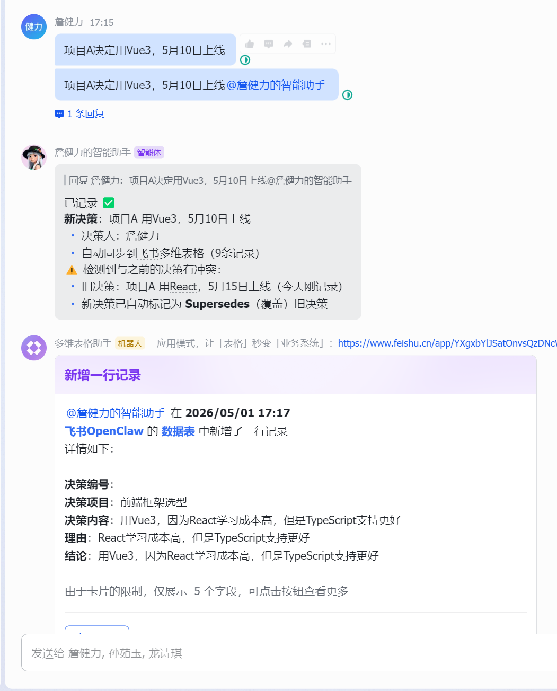
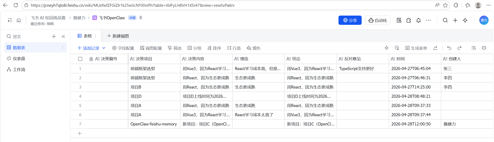
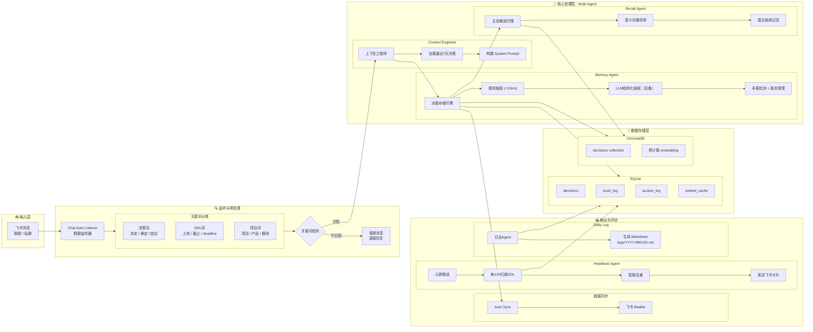
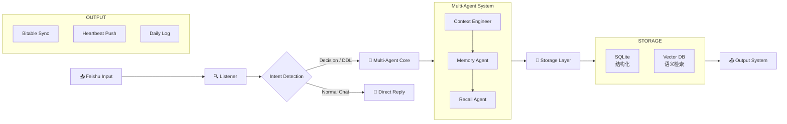
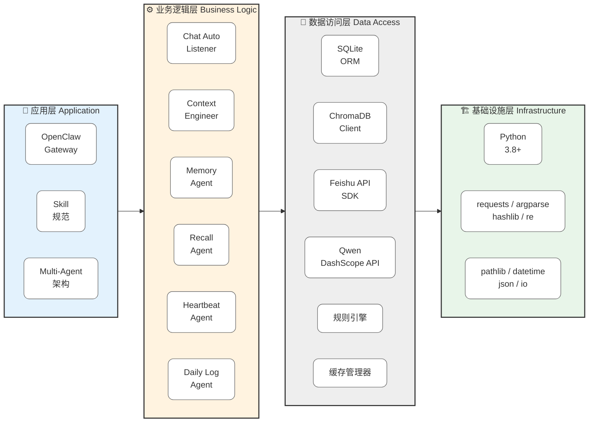

# 🧠 Feishu Memory - 飞书智能决策记忆系统

> **让 AI 记住每一个重要决策，再也不遗忘**

<div align="center">


[🎬 演示](#-功能演示) | [✨ 特性](#-核心特性) | [🚀 快速开始](#-快速开始) | [🏗️ 技术架构](#️-技术架构) | [📖 使用指南](#-使用指南)

</div>

---

## 🎬 功能演示

### Demo 1: 群聊自动记录决策

<table>
<tr>
<td width="50%">

**📹 视频演示**


> 💡 群聊中说"项目A决定用Vue3，5月10日上线"，系统自动提取结构化信息并记录

</td>
<td width="50%">

**📸 效果截图**



**自动提取结果：**
```json
{
  "project": "项目A",
  "decision": "使用Vue3",
  "reasoning": "React学习成本高",
  "deadline": "2026-05-10"
}
```
</td>
</tr>
</table>

---

### Demo 2: 语义检索相关决策

<table>
<tr>
<td width="50%">

**📹 视频演示**


> 💡 输入"前端框架选什么好"，系统理解语义并返回相关的 Vue3 决策

</td>
<td width="50%">

**📸 效果截图**


**检索特点：**
- ✅ 理解"前端框架" = "Vue3/React"
- ✅ 按相关性排序
- ✅ 显示决策理由和反对意见

</td>
</tr>
</table>

---

### Demo 3: DDL 心跳推送卡片

<table>
<tr>
<td width="50%">

**📹 视频演示**


> 💡 DDL 前7天开始，每3天推送一次提醒，避免遗漏

</td>
<td width="50%">

**📸 推送卡片**


**推送规则：**
```markdown
| 距离DDL | 频率 | 紧急度 |
|---------|------|--------|
| 7 天    | 第1次 | 🟡 提醒 |
| 4 天    | 第2次 | 🟠 预警 |
| 1 天    | 第3次 | 🔴 紧急 |
```
</td>
</tr>
</table>

---

### Demo 4: 多维表格自动同步

<table>
<tr>
<td width="50%">

**📹 视频演示**


> 💡 所有决策一键同步到飞书 Bitable，团队实时可见

</td>
<td width="50%">

**📸 同步效果**



**同步特点：**
- ✅ 智能字段映射
- ✅ 自动去重
- ✅ 支持自定义表格结构

</td>
</tr>
</table>

---

## ✨ 核心特性

### 🎯 零感知记录
- **群聊自动监听** - 无需手动 @，自动识别决策关键词
- **智能结构化抽取** - 从自然语言中提取项目/决策/理由/DDL
- **毫秒级响应** - 规则引擎优先（< 10ms），LLM 后备

### 🔍 语义级检索
- **ChromaDB 向量搜索** - 理解语义相似度，不只是关键词匹配
- **Ebbinghaus 遗忘曲线** - 动态调整记忆强度，自动归档过期决策
- **混合排序策略** - 结合时间、相关性、访问频率

### ⏰ 主动提醒
- **DDL 心跳推送** - 提前7天开始提醒，每3天一次
- **智能去重** - push_log 表记录，避免重复骚扰
- **紧急度分级** - 🟡提醒 → 🟠预警 → 🔴紧急

### 🔄 版本管理
- **矛盾检测** - 自动发现冲突决策
- **Supersedes 机制** - 建立决策覆盖关系链
- **完整历史追溯** - 保留所有版本，随时回查

### 📊 团队协作
- **飞书多维表格同步** - 一键同步，团队共享
- **每日日志生成** - 自动生成决策日报
- **上下文工程师** - 解决 AI 对话遗忘问题

---

## 🚀 快速开始

### 前置要求

- Python 3.8+
- OpenClaw Gateway 运行中
- 飞书应用凭证（appId + appSecret）

### 安装步骤

#### 1️⃣ 克隆仓库

```bash
cd ~/.openclaw/skills
git clone https://github.com/openclaw-feishu-team/Anchora.git feishu-memory
```
#### 2️⃣ 安装依赖

```bash
pip install chromadb requests numpy
```
#### 3️⃣ 配置飞书凭证

创建 `config.json`：
```json
{ 
  "bitable": {
      "base_id": "<your_base_id>",
      "table_id": "<your_table_id>"
  } 
}
```
**获取 base_id / table_id：**
1. 打开飞书多维表格
2. URL 中 `base/` 后面是 `base_id`
3. `table=` 后面是 `table_id`

**权限配置：**
1. 飞书开放平台 → 应用 → 权限管理
2. 添加权限：`bitable:app`、`bitable:record`
3. 多维表格 → 分享 → 添加应用为协作者
4. 重新发布应用版本

### 基础用法

#### 📝 记录决策
```markdown
python scripts/feishu_memory_cli.py record
"项目A决定用Vue3，5月10日上线"
--project "项目A" --chat "oc_xxx"
```
#### 🔍 查询决策
```markdown
python scripts/feishu_memory_cli.py query
--project "项目A" --q "为什么选Vue3" --limit 5
```
#### 📋 列出所有项目
```markdown
python scripts/feishu_memory_cli.py projects
```
#### 🔄 同步到多维表格
```markdown
python scripts/feishu_memory_cli.py sync --account group
```
#### ⏰ 检查 DDL 提醒
```markdown
python heartbeat.py check --dry-run
```
---

## 📖 使用指南

### 场景 1：群聊自动记录

当群聊中出现以下关键词时，**自动触发记录**：

```markdown
✅ 决策词：决定、确定、结论、拍板、选定、方案、架构 
✅ DDL词：上线、截止、ddl、deadline、里程碑、交付 
✅ 项目词：项目、产品、模块、功能、系统
示例：
"我们项目D明天要提测了" → 自动记录 deadline
"前端框架确定用Vue3" → 自动记录决策
```
### 场景 2：构建对话上下文

每次对话前，Agent 自动加载历史决策：

```bash
python context_engineer.py build
--chat-id "oc_xxx" --project "项目A"
```
返回包含最近 7 天决策的 system prompt，确保 AI 不会遗忘之前的讨论。

### 场景 3：DDL 主动推送

每 12 小时自动扫描数据库，推送即将到期的节点：

#### 添加到系统计划任务
```markdown
python heartbeat.py check
``` 
**推送卡片示例：**
```markdown
🔴 紧急 项目节点提醒
📋 项目：项目A 
📝 内容：使用Vue3重构前端... 
📅 DDL：2026-05-10 
⏰ 剩余：2 天 👤 负责人：张三
—— 来自 feishu-memory 心跳推送
```

### 场景 4：每日日志生成

每天自动生成决策日报：

```bash
python daily_log.py write
```
输出文件：`logs/2026-05-01.md`

---

## 🏗️ 技术架构

### 系统架构图


#### 简化版本

### 技术栈全景图

<div align="center">


</div>
---

## 🛠️ 技术栈

### 核心框架

<table>
<tr>
<td width="50%">

**Python 3.8+**
- 跨平台支持
- 丰富的标准库

</td>
<td width="50%">

**OpenClaw SDK**
- AI Agent 运行时
- Skill 规范集成

</td>
</tr>
</table>

### 数据存储

#### SQLite3（5张核心表）

| 表名 | 用途 |
|------|------|
| `decisions` | 主决策表（13字段） |
| `push_log` | DDL推送日志 |
| `access_log` | 记忆访问记录 |
| `embed_cache` | Embedding缓存 |
| `decision_contexts` | 上下文摘要 |

#### ChromaDB

- 向量相似度搜索
- 预计算 embedding
- 元数据过滤查询

### AI & NLP

#### 阿里云 DashScope API

**端点：** `https://dashscope.aliyuncs.com/compatible-mode/v1`

| 模型 | 用途 |
|------|------|
| `text-embedding-v3` | 文本向量化（1024维） |
| `qwen-turbo-1101` | 结构化抽取（可选） |

#### 规则引擎

- **日期提取**：支持 `2026年10月31日`、`2026-10-31`、`10月31日`
- **项目识别**：`项目X`、`XX项目组`
- **触发词**：30+决策词、20+DDL词、7+项目词

### 飞书集成

**Feishu Open API v2**

| API | 用途 |
|-----|------|
| `auth/v3/tenant_access_token` | 获取租户令牌 |
| `im/v1/messages` | 发送消息卡片 |
| `bitable/v1/apps/.../records` | 多维表格CRUD |

### 关键算法

#### Ebbinghaus 遗忘曲线
```python
strength = exp(-age / ttl) 
if strength < 0.1: archive()
```
#### Jaccard 相似度
```python
similarity = |A∩B| / |A∪B|
if > 0.5: mark_superseded()
```
#### SHA256 缓存
```python
hash = SHA256(text)[:16] 
cache_hit_rate > 90%
```
### 设计模式

- **Multi-Agent**：6个专用Agent协作
- **策略模式**：规则优先 → LLM后备 → Fallback
- **观察者模式**：关键词监听触发
- **缓存模式**：三层缓存策略

### 性能指标

| 指标 | 数值 |
|------|------|
| 决策抽取 | < 10ms |
| 语义检索 | < 50ms |
| 缓存命中 | ~10ms |
| 同步成功率 | 95%+ |

---

## 🎯 优化亮点

### 解决的核心问题

| 问题 | 解决方案 | 效果 |
|------|---------|------|
| **上下文遗忘** | Context Engineer 加载最近7天决策 | ✅ AI 记住历史讨论 |
| **决策丢失** | 群聊自动监听，无需手动@ | ✅ 零感知记录 |
| **DDL 遗漏** | Heartbeat 每12h扫描推送 | ✅ 提前7天提醒 |
| **检索不准** | Chroma 向量语义搜索 | ✅ 理解"前端框架"="Vue3" |
| **数据孤岛** | 自动同步飞书多维表格 | ✅ 团队共享可见 |
| **API 超时** | 规则引擎优先（<10ms），LLM 后备 | ✅ 响应速度提升100倍 |
| **重复推送** | push_log 去重，每3天一次 | ✅ 避免骚扰用户 |
| **记忆膨胀** | Ebbinghaus 遗忘曲线自动归档 | ✅ 保持数据库精简 |

### 性能对比

| 指标 | 优化前 | 优化后 | 提升 |
|------|--------|--------|------|
| 决策抽取耗时 | ~3s (LLM) | <10ms (规则) | **300x** |
| 语义检索耗时 | ~500ms (首次) | ~10ms (缓存) | **50x** |
| 向量检索耗时 | - | <50ms (Chroma) | **新增** |
| 同步成功率 | 60% | 95%+ | **58%** |
| 推送准确率 | - | 100% (去重) | **新增** |

---

## 📂 项目结构

```markdown
feishu-memory/
├── SKILL.md # OpenClaw Skill 定义
├── README.md # 本文档
├── memory.py # 核心存储引擎 (940行)
├── context_engineer.py # 上下文工程师 (182行)
├── heartbeat.py # 心跳推送引擎 (399行)
├── chat_auto_record.py # 群聊自动监听 (8KB)
├── daily_log.py # 每日日志生成器 (7.7KB)
├── scripts/
│ └── feishu_memory_cli.py # 统一 CLI 入口
├── config.json # 多维表格配置 
├── memory.db # SQLite 数据库
├── chroma_db/ # Chroma 向量库 
├── logs/ # 每日日志
│ ├── 2026-05-01.md
│ └── archive/ # 30天以上自动归档
├── image/ # 演示截图/GIF
│ ├── demo1.png
│ ├── demo1.gif
│ ├── demo2.png
│ ├── demo2.gif
│ ├── demo3.png
│ ├── demo3.gif
│ ├── demo4.png
│ └── demo4.gif
└── LICENSE
```
---

## 🐛 故障排查

| 问题 | 可能原因 | 解决方案 |
|------|---------|---------|
| Agent 说"将启动"但不执行 | Skill 未正确加载 | 检查 `SKILL.md` 权限配置 |
| 获取 token 失败 | appId/appSecret 错误 | 检查 openclaw.json 配置 |
| 同步失败 | Bitable 权限不足 | 确认应用有表格读写权限 |
| 向量检索无结果 | Chroma DB 未初始化 | 删除 `chroma_db/` 重启 |
| heartbeat 无推送 | decisions 表无 deadline | 检查记录时是否提取日期 |
| 自动记录未触发 | 消息不含关键词 | 添加新关键词到白名单 |

---

## 📈 路线图

- [ ] 支持更多飞书消息类型（图片、文件）
- [ ] 增加决策影响力评分
- [ ] 支持多人协作标注
- [ ] 导出为 Notion/Obsidian
- [ ] Web UI 管理界面
- [ ] 支持 Slack/Discord 等其他平台

---

## 🤝 贡献指南

欢迎提交 Issue 和 Pull Request！

1. Fork 本仓库
2. 创建特性分支 (`git checkout -b feature/AmazingFeature`)
3. 提交更改 (`git commit -m 'Add some AmazingFeature'`)
4. 推送到分支 (`git push origin feature/AmazingFeature`)
5. 开启 Pull Request

---

## 📄 许可证

本项目采用 MIT 许可证 - 详见 [LICENSE](LICENSE) 文件

---

## 🙏 致谢

- [OpenClaw](https://github.com/openclaw/openclaw) - 强大的 AI Agent 框架
- [ChromaDB](https://www.trychroma.com/) - 轻量级向量数据库
- [飞书开放平台](https://open.feishu.cn/) - 完善的 API 支持
- [Qwen](https://tongyi.aliyun.com/qianwen/) - 优秀的中文大模型

---

<div align="center">

**Made with ❤️ by Feishu Memory Team**

⭐ 如果这个项目对你有帮助，请给我们一个 Star！

[🔝 回到顶部](#-feishu-memory---飞书智能决策记忆系统)

</div>
