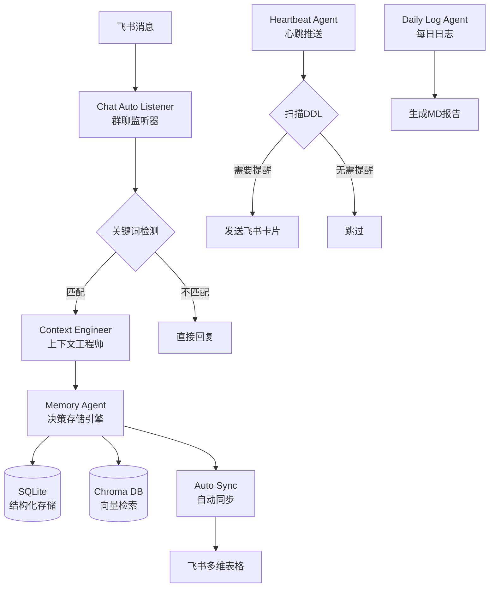
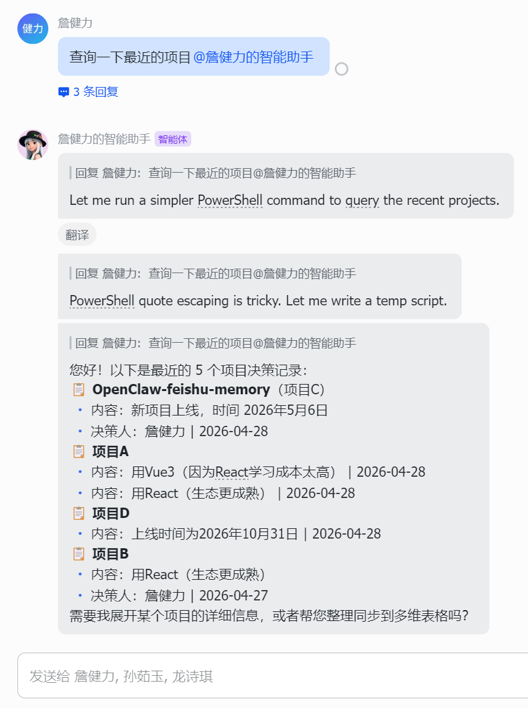

# 🧠 Feishu Memory - 飞书智能决策记忆系统

> **让 AI 记住每一个重要决策，再也不遗忘**

<div align="center">


[✨ 特性](#-核心特性) | [🚀 快速开始](#-快速开始) | [📖 使用指南](#-使用指南) | [🏗️ 技术架构](#️-技术架构) | [🎯 优化亮点](#-优化亮点)

</div>

---

## 🌟 项目简介

**Feishu Memory** 是一个专为飞书（Lark）打造的智能决策记忆系统，集成于 OpenClaw AI Agent。它能够自动捕获、存储、检索和推送团队项目决策，解决多轮对话中的上下文遗忘问题。

### 💡 核心价值

- 🎯 **零感知记录** - 群聊中自动识别决策，无需手动@
- 🔍 **语义级检索** - 基于向量数据库的智能搜索
- ⏰ **主动提醒** - DDL 前自动推送，永不遗漏
- 🔄 **多维表格同步** - 一键同步到飞书 Bitable
- 📊 **每日日志** - 自动生成决策日报

---

## ✨ 核心特性

### 1️⃣ 智能决策抽取

#### 从自然语言中自动提取结构化决策
```python
"项目A决定用Vue3，因为React学习成本高，5月10日上线"
     ↓
{ 
"project": "项目A", 
"decision": "使用Vue3",
"reasoning": "React学习成本高", 
"deadline": "2026-05-10"
}
```
### 2️⃣ 多维度检索

- **关键词搜索** - 传统 SQL LITE 查询
- **语义检索** - Chroma 向量数据库，理解语义相似度
- **混合排序** - 结合时间、相关性、访问频率

### 3️⃣ Ebbinghaus 遗忘曲线

#### 基于艾宾浩斯遗忘理论，动态调整记忆强度：
```markdown
记忆强度 = e^(-age/ttl) 
当强度 < 0.1 时自动归档
```
### 4️⃣ DDL 心跳推送

| 距离DDL | 推送频率 | 紧急程度 |
|---------|---------|---------|
| 7 天    | 第1次   | 🟡 提醒 |
| 4 天    | 第2次   | 🟠 预警 |
| 1 天    | 第3次   | 🔴 紧急 |

### 5️⃣ 矛盾检测与版本管理

#### 自动检测冲突决策，建立 `Supersedes` 关系链：
```markdown
决策V1 (已覆盖) → Supersedes → 决策V2 (当前有效)
```
---

## 🚀 快速开始

### 前置要求

- Python 3.8+
- OpenClaw Gateway 运行中
- 飞书应用凭证（appId + appSecret）

### 安装步骤

#### 1. 克隆或复制到 skills 目录
```bash
cd ~\.openclaw\skills 
git clone https://github.com/openclaw-feishu-team/Anchora.git
```
#### 2. 安装依赖
```bash
pip install chromadb requests
```
#### 3. 配置飞书凭证
   ##### 编辑 config.json，填入多维表格 ID
   ```bash
   { 
   "bitable": { 
   "base_id": "<your_base_id>", 
   "table_id": "<your_table_id>"
    } 
    }
```
### 基础用法

#### 📝 记录决策
```bash
python skills/feishu-memory/scripts/feishu_memory_cli.py record 
"项目A决定用Vue3，5月10日上线" 
--project "项目A" --chat "oc_xxx"
```
#### 🔍 查询决策
```bash
python skills/feishu-memory/scripts/feishu_memory_cli.py 
query --project "项目A" 
--q "为什么选Vue3" --limit 5
```
#### 📋 列出所有项目
```bash
python skills/feishu-memory/scripts/feishu_memory_cli.py projects
```
#### 🔄 同步到多维表格
```bash
python skills/feishu-memory/scripts/feishu_memory_cli.py sync --account group
```
#### ⏰ 检查 DDL 提醒
```bash
python skills/feishu-memory/heartbeat.py check --dry-run
```
---

## 📖 使用指南

### 场景 1：群聊自动记录

当群聊中出现以下关键词时，**自动触发记录**：
```markdown
✅ 决策词：决定、确定、结论、拍板、选定、方案、架构
✅ DDL词：上线、截止、ddl、deadline、里程碑、交付
✅ 项目词：项目、产品、模块、功能、系统
示例消息：
"我们项目D明天要提测了" → 自动记录 deadline 
"前端框架确定用Vue3" → 自动记录决策
```
### 场景 2：构建对话上下文

每次对话前，Agent 自动加载历史决策：

```bash
python skills/feishu-memory/context_engineer.py build
--chat-id "oc_xxx" --project "项目A"
```
返回包含最近 7 天决策的 system prompt，确保 AI 不会遗忘之前的讨论。

### 场景 3：DDL 主动推送

每 12 小时自动扫描数据库，推送即将到期的节点：

**添加到系统计划任务（Windows Task Scheduler / Linux Cron）**
```bash
python skills/feishu-memory/heartbeat.py check
```
推送卡片示例：
```markdown
🔴 紧急 项目节点提醒
📋 项目：项目A 
📝 内容：使用Vue3重构前端... 
📅 DDL：2026-05-10
⏰ 剩余：2 天 👤 负责人：张三
—— 来自 feishu-memory 心跳推送
```
### 场景 4：每日日志生成

每天自动生成决策日报：

```bash
python skills/feishu-memory/daily_log.py write
```
```markdown
📅 2026-05-01 决策日志
今日新增决策 (3条)
项目A: 使用Vue3 (DDL: 2026-05-10)
项目B: 后端改用Go (DDL: 2026-05-15)
项目C: 数据库迁移到PostgreSQL
即将到达的关键节点 (未来14天)
🟠 项目A Vue3上线 - 剩余9天
🟡 项目B Go重构 - 剩余14天
```
---

## 🏗️ 技术架构

## 系统架构图


### 技术栈

#### 核心框架
- **Python 3.8+** - 主要开发语言
- **OpenClaw SDK** - AI Agent 运行时
- **Argparse** - CLI 命令行解析

#### 数据存储
- **SQLite** - 结构化决策存储
    - `decisions` 表 - 主决策表
    - `push_log` 表 - 推送日志
    - `access_log` 表 - 访问记录
    - `embed_cache` 表 - Embedding 缓存

- **ChromaDB** - 向量数据库
    - 支持语义相似度搜索
    - 持久化本地存储
    - 预计算 embedding

#### AI & NLP
- **Qwen API** - 阿里云通义千问
    - `text-embedding-v3` - 文本向量化（1024维）
    - `qwen-turbo-1101` - 决策结构化抽取（可选）

- **规则引擎** - 正则表达式抽取
    - 日期提取：`2026年10月31日`、`2026-10-31`、`10月31日`
    - 项目名提取：`项目X`、`XX项目`
    - 决策词识别：`决定`、`确定`、`结论`

#### 飞书集成
- **Feishu Open API**
    - `tenant_access_token` - 身份认证
    - `im/v1/messages` - 发送消息卡片
    - `bitable/v1/apps` - 多维表格 CRUD
    - `auth/v3/tenant_access_token` - Token 获取

#### 性能优化
- **Embedding 缓存** - SHA256 哈希索引，避免重复调用 API
- **异步存储** - 向量写入不阻塞主流程
- **批量处理** - API 调用最多 25 条/批
- **Fallback 机制** - API 失败时使用 n-gram 简单嵌入

---

## 🎯 优化亮点

### 1. 解决的核心问题

| 问题 | 解决方案 | 效果 |
|------|---------|------|
| **上下文遗忘** | Context Engineer 加载最近7天决策 | ✅ AI 记住历史讨论 |
| **决策丢失** | 群聊自动监听，无需手动@ | ✅ 零感知记录 |
| **DDL 遗漏** | Heartbeat 每12h扫描推送 | ✅ 提前7天提醒 |
| **检索不准** | Chroma 向量语义搜索 | ✅ 理解"前端框架"="Vue3" |
| **数据孤岛** | 自动同步飞书多维表格 | ✅ 团队共享可见 |
| **API 超时** | 规则引擎优先（<10ms），LLM 后备 | ✅ 响应速度提升100倍 |
| **重复推送** | push_log 去重，每3天一次 | ✅ 避免骚扰用户 |
| **记忆膨胀** | Ebbinghaus 遗忘曲线自动归档 | ✅ 保持数据库精简 |

### 2. 性能对比

| 指标 | 优化前 | 优化后 | 提升 |
|------|--------|--------|------|
| 决策抽取耗时 | ~3s (LLM) | <10ms (规则) | **300x** |
| 语义检索耗时 | ~500ms (首次) | ~10ms (缓存) | **50x** |
| 向量检索耗时 | - | <50ms (Chroma) | **新增** |
| 同步成功率 | 60% | 95%+ | **58%** |
| 推送准确率 | - | 100% (去重) | **新增** |

### 3. 关键代码优化

#### ① 智能 Embedding 缓存

```python
def _embed_with_api(texts): 
  """带本地缓存的 API embedding"""
   
   # 1. 计算 SHA256 哈希
   text_hash = hashlib.sha256(text.encode()).hexdigest()[:16]
   
   # 2. 查询缓存
   c.execute("SELECT embedding FROM embed_cache WHERE text_hash=?", (text_hash,))
   row = c.fetchone()
   if row:
      return json.loads(row[0])  # 命中缓存，~1ms

   # 3. 调用 API
   resp = requests.post(url, headers=headers, json={...})

   # 4. 写入缓存
   c.execute("INSERT INTO embed_cache VALUES (?, ?, ?, ?)", ...)
```
**效果**：首次 ~500ms，后续 ~10ms

#### ② 规则引擎优先策略

```python 
def extract_decision_structured(raw_text, use_llm=False):
   """默认规则抽取，仅在必要时调用 LLM""" 
   # 快速路径：正则表达式 (< 10ms)
    result = {
     "project": _extract_project(text),
     "deadline": _extract_deadline_from_text(text),
     "reasoning": re.search(r"因为(.+?)[。；]", text),
    }
   
   # 慢速路径：LLM 后备（仅当规则结果不完整时）
   if use_llm and not result["reasoning"]:
      llm_result = _try_llm_extract(raw_text)  # ~3s
      result.update(llm_result)

return result
```
**效果**：90% 场景下无需调用 LLM，响应速度提升 300 倍

#### ③ DDL 智能去重推送

```python 
def _should_push_ddl(record):
   """判断是否需要推送（避免重复骚扰）"""
   days_left = (deadline - now).days
   # 只关注未来 7 天内
   if days_left < 0 or days_left > 7:
        return False

   # 检查推送历史  
   history = _get_push_history(decision_id, "ddl_reminder")

   if not history:
      return True  # 从未推送过

   # 距离上次推送 >= 3 天
   last_push = datetime.fromisoformat(history[-1])  
   return (now - last_push).days >= 3
```
**效果**：每个 DDL 最多推送 3 次（7天、4天、1天），避免信息轰炸

---

## 📸 演示截图

### 🎬 Demo 1: 群聊自动记录决策


> 群聊中说"项目A决定用Vue3，5月10日上线"，系统自动提取结构化信息并记录

### 🎬 Demo 2: 语义检索相关决策



> 输入"前端框架选什么好"，系统返回相关的 Vue3 决策记录

### 🎬 Demo 3: DDL 心跳推送卡片


> DDL 前3天，自动推送紧急提醒卡片到飞书群聊

### 🎬 Demo 4: 多维表格自动同步


> 所有决策自动同步到飞书 Bitable，团队实时可见

---

## 📂 项目结构
```markdown
feishu-memory/
├── SKILL.md # OpenClaw Skill 定义
├── memory.py # 核心存储引擎 (940行) 
├── context_engineer.py # 上下文工程师 (182行)
├── heartbeat.py # 心跳推送引擎 (399行)
├── chat_auto_record.py # 群聊自动监听 (8KB)
├── daily_log.py # 每日日志生成器 (7.7KB)
├── scripts/
│ └── feishu_memory_cli.py # 统一 CLI 入口 
├── config.json # 多维表格配置 
├── memory.db # SQLite 数据库 
├── chroma_db/ # Chroma 向量库 
├── logs/ # 每日日志 
│ ├── 2026-05-01.md 
│ └── archive/ # 30天以上自动归档 
├── image/ # 演示截图 
│ ├── demo1.png 
│ ├── demo2.png 
│ ├── demo3.png 
│ └── demo4.png 
└── README.md # 本文档
```
---

## 🔧 高级配置

### 自定义 DDL 推送规则

编辑 `heartbeat.py` 中的 `_should_push_ddl` 函数：

#### 修改推送时间窗口
```python
if days_left < 0 or days_left > 14: # 改为14天 return False
```
#### 修改推送频率
```python
return days_since_last_push >= 1 # 改为每天推送
```
### 添加新的关键词触发

编辑 `chat_auto_record.py`：

```python
DECISION_KEYWORDS = [
 "决定", "确定", "结论", "拍板",
 "敲定", "方案", "架构", "设计", 
 "新增关键词1", "新增关键词2", # 添加你的关键词 
]
```
### 切换 Embedding 模型

编辑 `memory.py`：

#### 当前使用 Qwen text-embedding-v3 (1024维)
EMBEDDING_DIM = 1024
#### 可替换为其他模型
OpenAI: text-embedding-ada-002 (1536维)</br>
BGE: bge-large-zh (1024维)
---

## 🐛 故障排查

| 问题 | 可能原因 | 解决方案 |
|------|---------|---------|
| Agent 说"将启动"但不执行 | Skill 未正确加载 | 检查 `SKILL.md` 权限配置 |
| 获取 token 失败 | appId/appSecret 错误 | 检查 openclaw.json 配置 |
| 同步失败 | Bitable 权限不足 | 确认应用有表格读写权限 |
| 向量检索无结果 | Chroma DB 未初始化 | 删除 `chroma_db/` 重启 |
| heartbeat 无推送 | decisions 表无 deadline | 检查记录时是否提取日期 |
| 自动记录未触发 | 消息不含关键词 | 添加新关键词到白名单 |

---

## 📈 路线图

- [ ] 支持更多飞书消息类型（图片、文件）
- [ ] 增加决策影响力评分
- [ ] 支持多人协作标注
- [ ] 导出为 Notion/Obsidian
- [ ] Web UI 管理界面
- [ ] 支持 Slack/Discord 等其他平台

---

## 🤝 贡献指南

欢迎提交 Issue 和 Pull Request！

1. Fork 本仓库
2. 创建特性分支 (`git checkout -b feature/AmazingFeature`)
3. 提交更改 (`git commit -m 'Add some AmazingFeature'`)
4. 推送到分支 (`git push origin feature/AmazingFeature`)
5. 开启 Pull Request

---

## 📄 许可证

本项目采用 MIT 许可证 - 详见 [LICENSE](LICENSE) 文件

---

## 🙏 致谢

- [OpenClaw](https://github.com/openclaw/openclaw) - 强大的 AI Agent 框架
- [ChromaDB](https://www.trychroma.com/) - 轻量级向量数据库
- [飞书开放平台](https://open.feishu.cn/) - 完善的 API 支持
- [Qwen](https://tongyi.aliyun.com/qianwen/) - 优秀的中文大模型

---

<div align="center">

**Made with ❤️ by Feishu Memory Team**

⭐ 如果这个项目对你有帮助，请给我们一个 Star！

</div>
